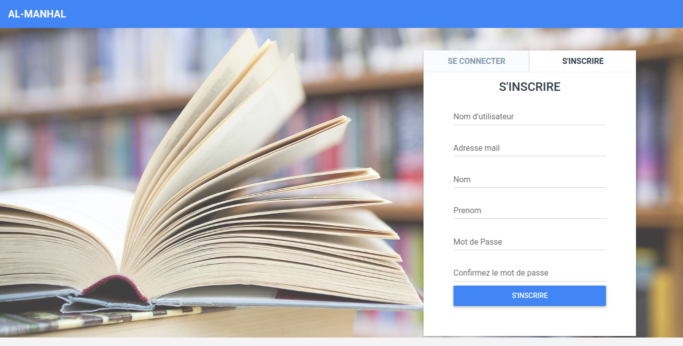
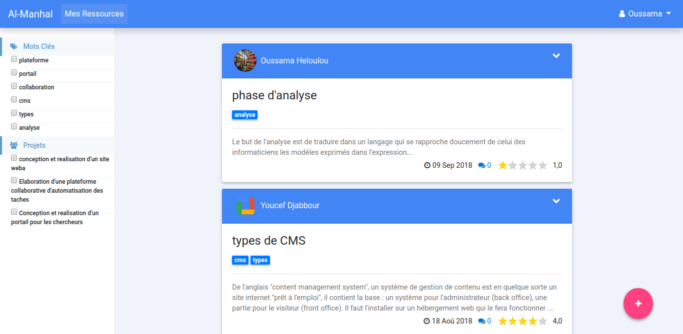
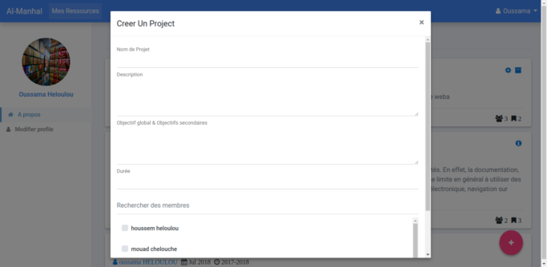
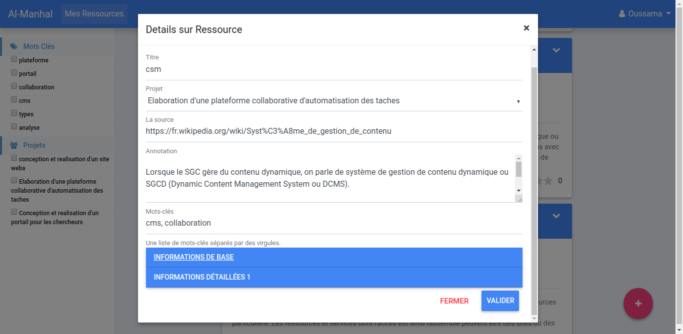
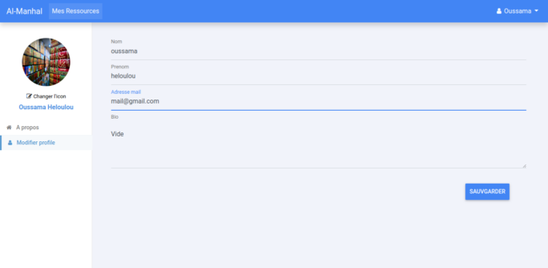
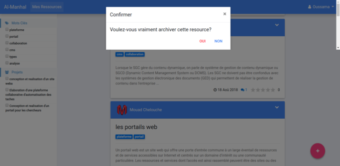
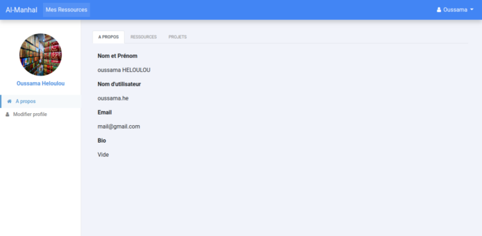
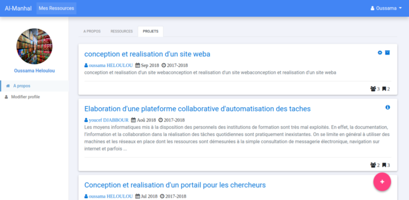

# Al Manhal 

This is a simple project developed as the Final Project Assignment to obtain Master 2 degree in the university of Jijel, Algeria.

The goal of the project was to: Design and implementation of a collaborative system to assist documentary research projects.

### How can I run Al Manhal

Simply follow these steps:

```
virtualenv -p python3 env
source env/bin/activate
pip install -r requirements.txt

python manage.py runserver 

```

Go to the home page `http://127.0.0.1:8000/portal/home/` and sign up



You will be redirected to page where you can see and publish resources.



### Screenshots












### Contributions
Contributions are welcome to improve the project.

### License

Any one has the right to use this project (but not commercial use) in accordance with Islamic law and its values.
